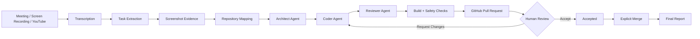
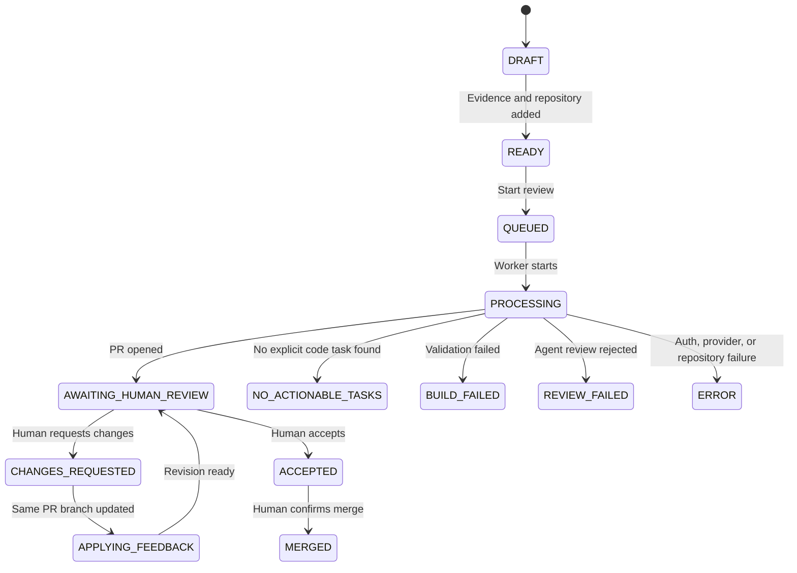

<div align="center">

# VisionPR

### From meeting evidence to merge-ready pull requests

VisionPR turns engineering meetings, screen recordings, YouTube walkthroughs, and visual bug reports into repository-aware code changes, validated pull requests, and human-approved merges.

[](https://visionpr-web.vercel.app/)
[](https://github.com/Abdeali-Badri/VisionPR)


**Built for the GDG Hackathon**

</div>

---

## The Problem

Great engineering context gets trapped in meetings.

A teammate explains a bug on a call. A designer shares a screen. A PM describes a change. Someone records it, but the actual implementation still depends on a developer manually rewatching the video, finding the relevant files, writing the patch, running tests, opening a pull request, and collecting review feedback.

VisionPR compresses that entire path into one traceable workflow.

## The Solution

VisionPR is an AI-powered, human-trusted pull request system.

Give it:

- A meeting recording
- A screen recording
- A YouTube walkthrough
- A prepared intelligence JSON file
- A public GitHub repository
- Optional build commands and implementation constraints

VisionPR extracts the engineering request, maps it to the codebase, generates a focused patch, validates the result, opens a GitHub pull request, and waits for a human decision before anything is merged.

## Why It Stands Out

| Hackathon Signal | What VisionPR Delivers |
|---|---|
| Real-world pain | Converts messy meeting context into actual code changes |
| Multimodal AI | Uses transcript, timestamps, screenshots, and visual evidence |
| Agentic engineering | Architect, Coder, and Reviewer agents collaborate on implementation |
| Production workflow | Opens real GitHub pull requests with branches, commits, and reports |
| Human trust | Accept, request changes, retry, and merge are separate controlled actions |
| Safety-first design | Protected paths, validated commands, scoped diffs, encrypted tokens |
| Full-stack product | React dashboard, FastAPI backend, workers, reports, OAuth, deployment configs |

## How It Works



## Core Features

### Multimodal Evidence Ingestion

VisionPR accepts:

- `.mp4`
- `.mov`
- `.mkv`
- `.avi`
- `.webm`
- `.m4v`
- YouTube URLs
- Prepared intelligence JSON files

It extracts timestamped transcript segments, translates context when needed, captures screenshots around important moments, and stores structured evidence for every generated task.

### Repository-Aware Code Generation

VisionPR does not blindly ask an LLM to edit code.

It first maps the target repository, filters generated or unsafe files, ranks relevant paths, detects build commands, and gives the agents bounded codebase context.

### Agentic Pull Request Workflow

VisionPR uses a three-agent implementation loop:

| Agent | Responsibility |
|---|---|
| Architect Agent | Finds likely target files and creates the implementation plan |
| Coder Agent | Applies the smallest focused patch using safe repository tools |
| Reviewer Agent | Checks correctness, scope, build results, and review readiness |

The loop is bounded so the system cannot edit indefinitely.

### Human-in-the-Loop Review

VisionPR stops at the pull request and waits.

The reviewer can:

- Open the generated PR
- Inspect changed files
- Read the evidence trail
- Request changes
- Push another AI-assisted revision to the same PR branch
- Accept changes
- Merge only after a separate confirmation

Acceptance is not merging. Merging is always explicit.

### Safety Model

VisionPR treats model output as untrusted.

- `.env` files are never sent to the model
- `.git`, virtual environments, dependency folders, and secret paths are blocked
- Repository paths are normalized and validated
- Build commands are allow-listed
- Agents cannot run arbitrary shell commands
- Git staging is restricted to approved files
- Tokens are encrypted before storage
- AI approval cannot override deterministic safety checks

## Product Screens

Add your screenshots here after deployment:

```md


```

## Architecture

```text
VisionPR/
|-- frontend/                 React + TypeScript + Vite web app
|   |-- src/pages/            Landing, dashboard, review wizard, review details
|   |-- src/components/       Shared UI components
|   |-- src/api.ts            API client
|   `-- vercel.json           Frontend routing config
|
|-- backend/                  FastAPI control plane
|   |-- app.py                API routes, auth, reviews, feedback, merge
|   |-- services.py           Review orchestration and dashboard logic
|   |-- worker.py             Background processing
|   |-- database.py           SQLite persistence
|   |-- security.py           OAuth/session helpers
|   `-- config.py             Environment configuration
|
|-- src/                      Core AI workflow
|   |-- extract_video.py      Media, transcript, translation, frame extraction
|   |-- codebase_mapper.py    Repository scanning and relevance mapping
|   |-- crew_engine.py        Agentic implementation runtime
|   |-- repository_manager.py Isolated clone/fork lifecycle
|   |-- github_publisher.py   Branch, commit, push, and PR publishing
|   |-- hitl_review_gate.py   Human approval and safety gate
|   |-- generate_summary.py   Markdown and JSON reports
|   `-- llm/                  Provider-neutral LLM setup
|
|-- tests/                    Unit and workflow tests
|-- data/                     Reports, uploads, extracted frames, run state
|-- Dockerfile                Backend production image
|-- railway.json              Railway backend deployment
|-- requirements.txt          Python dependencies
|-- pyproject.toml            Project metadata
`-- main.py                   CLI entry point
```

## Tech Stack

| Layer | Tools |
|---|---|
| Frontend | React 18, TypeScript, Vite, Lucide React |
| Backend | Python 3.12, FastAPI, Uvicorn, SQLite |
| Agents | CrewAI, CrewAI Tools, LiteLLM |
| AI Providers | Groq, Google Gemini |
| Media Processing | FFmpeg, OpenCV, Faster Whisper, Pillow |
| GitHub | GitHub OAuth, PyGithub, Git CLI |
| Deployment | Vercel frontend, Railway backend, Railway volume |
| Testing | Python unittest, TypeScript build, Playwright browser QA |

## Local Development

### Prerequisites

- Python 3.12+
- Node.js 20+
- Git
- FFmpeg
- Groq API key
- Optional Gemini API key
- GitHub OAuth app for real authenticated sessions

### Clone

```bash
git clone https://github.com/Abdeali-Badri/VisionPR.git
cd VisionPR
```

### Backend Setup

```bash
python -m venv .venv
```

Windows PowerShell:

```powershell
.\.venv\Scripts\Activate.ps1
```

macOS or Linux:

```bash
source .venv/bin/activate
```

Install dependencies:

```bash
python -m pip install --upgrade pip
pip install -r requirements.txt
```

Start the API:

```bash
python -m uvicorn backend.app:app --reload --port 8000
```

Health check:

```bash
curl http://127.0.0.1:8000/api/health
```

### Frontend Setup

```bash
cd frontend
npm install
npm run dev
```

Open:

```text
http://localhost:5173
```

## Environment Variables

Create `.env` in the project root:

```bash
cp .env.example .env
```

Windows PowerShell:

```powershell
Copy-Item .env.example .env
```

Example local configuration:

```env
VISIONPR_MODE=crewai
VISIONPR_LLM_PROVIDER=groq
VISIONPR_LLM_MODEL=llama-3.3-70b-versatile

GROQ_API_KEY=your_groq_api_key
GEMINI_API_KEY=your_gemini_api_key

GITHUB_CLIENT_ID=your_github_oauth_client_id
GITHUB_CLIENT_SECRET=your_github_oauth_client_secret
VISIONPR_SESSION_SECRET=replace_with_a_long_random_value

VISIONPR_FRONTEND_URL=http://127.0.0.1:5173
VISIONPR_BACKEND_URL=http://127.0.0.1:8000
VISIONPR_COOKIE_SECURE=0
VISIONPR_DEMO_MODE=0
```

For local GitHub OAuth, use this callback URL:

```text
http://127.0.0.1:8000/api/auth/github/callback
```

## CLI Usage

Run the full pipeline from a local recording:

```bash
python main.py \
  --repository owner/repository \
  --media meeting.mp4 \
  --build-command "python -m pytest"
```

Run from YouTube:

```bash
python main.py \
  --repository owner/repository \
  --media "https://youtu.be/video-id" \
  --build-command "npm test"
```

Run without publishing:

```bash
python main.py \
  --repository owner/repository \
  --media meeting.mp4 \
  --local-only
```

Reports are written to:

```text
data/reports/
```

## Execution Modes

| Mode | Description |
|---|---|
| `auto` | Uses online agents when credentials exist, otherwise falls back to offline demo mode |
| `crewai` | Requires a supported LLM provider and runs the full agent workflow |
| `offline` | Uses deterministic demo agents without external LLM calls |

Offline mode is useful for demos, tests, and CI. It proves the workflow contracts, safety gates, repository reads/writes, build validation, and handoff structure without claiming real AI reasoning.

## Web App Flow



## Testing

Run backend tests:

```bash
python -m unittest discover -s tests -v
```

Build the frontend:

```bash
cd frontend
npm run build
```

Run browser QA while the app is running:

```bash
npm run qa:browser
```

Normal tests do not require real API keys or live LLM calls.

## Deployment

### Frontend on Vercel

```text
Root directory: frontend
Build command: npm run build
Output directory: dist
```

Required variable:

```env
VITE_API_URL=https://your-backend-domain
```

### Backend on Railway

VisionPR includes a `Dockerfile` and `railway.json`.

Attach a persistent Railway volume at:

```text
/app/data
```

Production variables:

```env
VISIONPR_WEB_DB=/app/data/visionpr_web.db
VISIONPR_UPLOAD_DIR=/app/data/web_uploads
VISIONPR_STATE_DIR=/app/data/visionpr_state
VISIONPR_FRONTEND_URL=https://your-frontend-domain
VISIONPR_BACKEND_URL=https://your-backend-domain
VISIONPR_COOKIE_SECURE=1
VISIONPR_DEMO_MODE=0
```

Production OAuth callback:

```text
https://your-backend-domain/api/auth/github/callback
```

## What We Built During the Hackathon

- Full-stack review dashboard
- GitHub OAuth login
- Review creation wizard
- Media upload and YouTube workflow support
- Background worker orchestration
- Repository cloning and mapping
- Agentic implementation pipeline
- GitHub branch, commit, push, and PR publishing
- PR diff viewer
- Request-changes revision loop
- Human accept and explicit merge flow
- Markdown and JSON reports
- Railway and Vercel deployment configuration
- Unit and workflow test coverage

## Future Roadmap

- Multi-repository change plans
- Organization-level policy controls
- Inline PR review comments from VisionPR
- Rich screenshot evidence viewer
- Slack and Discord review notifications
- Cost and token budget dashboard
- Enterprise audit export
- Private repository support with scoped installation permissions

## Team

Built for the GDG Hackathon by developers who believe AI should accelerate engineering without removing human judgment from the merge button.

## Links

| Resource | URL |
|---|---|
| Live App | https://visionpr-web.vercel.app/ |
| Repository | https://github.com/Abdeali-Badri/VisionPR |
| Issues | https://github.com/Abdeali-Badri/VisionPR/issues |


<div align="center">

**VisionPR: evidence in, reviewed PR out.**

[Launch Demo](https://visionpr-web.vercel.app/) |
[View Code](https://github.com/Abdeali-Badri/VisionPR) |
[Open Issues](https://github.com/Abdeali-Badri/VisionPR/issues)

</div>
