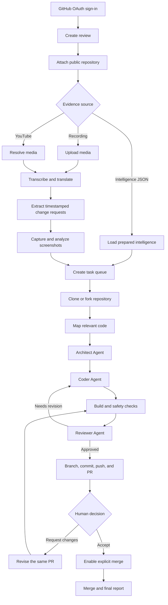
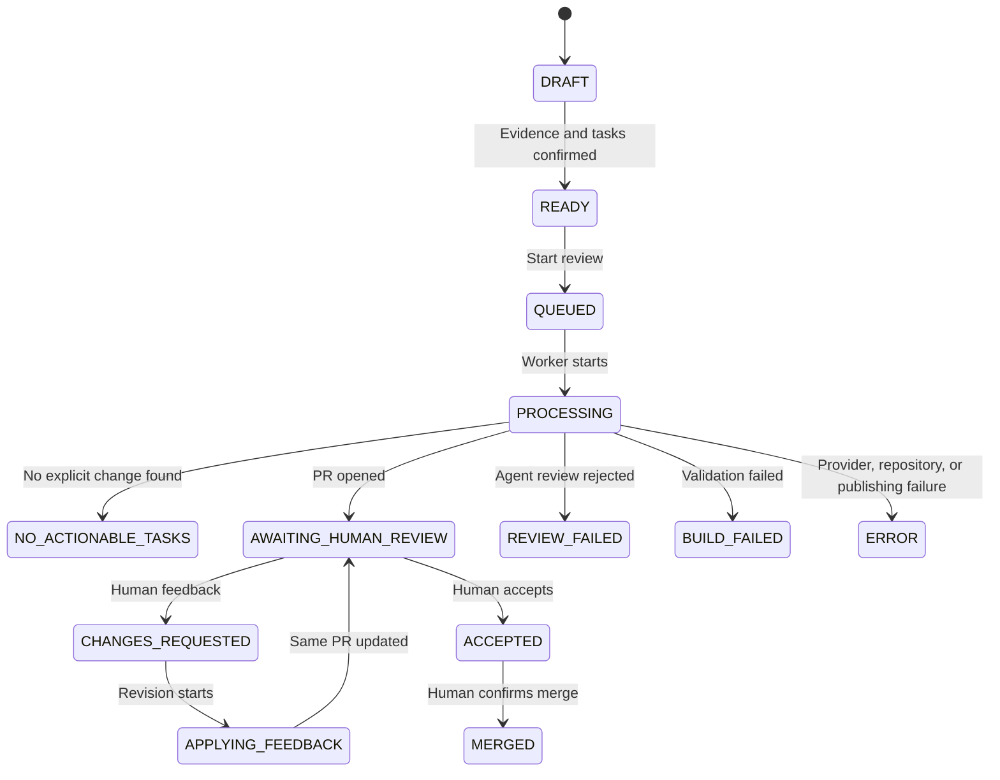

# VisionPR Workflow

VisionPR converts a meeting recording, screen recording, or visual bug report into a reviewed GitHub Pull Request. The workflow extracts issue context, maps it to repository files, generates a patch, publishes a PR, and waits for human review.

## End-To-End Flow



Each web review receives a unique `run_id`. The run ID links its evidence,
repository workspace, task results, branch ownership, pull request, timeline,
and generated reports.

## Phase 1: Multimodal Intelligence Extraction

1. Validate the input recording.
2. Extract audio from the video.
3. Transcribe audio into timestamped segments.
4. Translate the transcript to English when needed.
5. Extract actionable software-development points.
6. Match each point to an approximate timestamp.
7. Extract screenshot frames around the timestamp.
8. Analyze screenshots for UI state, errors, files, controls, and visible behavior.
9. Save the transcript, key points, screenshots, and visual analysis as `video_intelligence.json`.

Supported recording formats include `.mp4`, `.mov`, `.mkv`, `.avi`, `.webm`,
and `.m4v`. If the meeting contains no explicit software change request, the
workflow ends with `NO_ACTIONABLE_TASKS` and does not create a branch or PR.

## Repository Acquisition

VisionPR accepts public GitHub URLs and `owner/repository` references. It reads
repository metadata, detects the default branch, and creates an isolated local
clone for the run.

The authenticated GitHub user is selected through OAuth. VisionPR pushes
directly when the user has permission. When upstream is read-only, it creates or
reuses a user-owned fork and opens the PR from that fork. The LLM never edits the
remote repository directly; all model changes happen inside the managed clone.

## Phase 2: Repository Context Mapping

1. Read the target repository structure.
2. Identify files related to the reported behavior.
3. Select the smallest useful set of relevant files.
4. Summarize each relevant file.
5. Extract useful symbols such as components, handlers, functions, routes, APIs, and tests.
6. Capture build commands and engineering constraints.
7. Produce `repository_context` for the agent workflow.

## Agentic Input Handoff

Phase 1 and Phase 2 are combined into `agentic_input`.

Key fields:

- `run_id`: Workflow run identifier.
- `issue_summary`: Plain-language issue or request.
- `meeting_issue_context`: Transcript and screenshot context.
- `repository_context`: Relevant files, repository map, summaries, and symbols.
- `build_commands`: Validation commands.
- `constraints`: Safety and engineering constraints.
- `max_review_attempts`: Agent retry limit.

## Phase 3: Agentic Patch Workflow

Phase 3 uses an Architect -> Coder -> Reviewer loop.

Architect Agent:

- Interprets the issue and visual context.
- Identifies the suspected cause.
- Selects target files.
- Lists files to avoid.
- Defines required changes and implementation steps.
- Recommends tests or build commands.

Coder Agent:

- Reads the target files.
- Makes the smallest safe code change.
- Preserves existing style and architecture.
- Avoids unrelated refactors.
- Runs validation commands.
- Returns modified files, patch notes, assumptions, and build results.

Reviewer Agent:

- Checks whether the patch solves the reported issue.
- Confirms the plan was followed.
- Detects unrelated file changes.
- Checks syntax, logic, build, and test risks.
- Approves the patch or requests concrete revisions.

If review fails, the workflow creates a `revision_request` with the original plan, reviewer feedback, build logs, previous modified files, and the retry attempt number. The loop continues until approval or the retry limit.

## Pull Request Publishing

1. Validate the approved agent workflow result.
2. Confirm build and test status.
3. Validate the target Git repository.
4. Validate changed files and target files.
5. Reject unsafe paths and unrelated worktree changes.
6. Create or reuse a VisionPR branch.
7. Stage only intended files.
8. Compute a patch fingerprint.
9. Commit the patch with workflow metadata.
10. Push the branch to GitHub.
11. Create or reuse a Pull Request.
12. Add PR details: requirement, plan, changed files, validation, visual evidence, and metadata.
13. Post an engineer-facing summary comment.
14. Persist PR state for review tracking.

Branch format:

```text
visionpr/<requirement-slug>-<run-id-prefix>-<run-hash>
```

The hash is derived from the complete run ID. It keeps branch names readable
while preventing reviews created on the same day from colliding. Existing
branches are reused only when their Git metadata or commit trailers prove that
they belong to the same VisionPR run.

## Human Review Gate

1. Fetch the latest PR state.
2. Check human reviews, inline comments, and actionable issue comments.
3. Ignore bot and service-account activity.
4. Treat `CHANGES_REQUESTED` as higher priority than approval.
5. Require approvals to apply to the active PR head commit.
6. If approved, mark the workflow approved for human merge.
7. If changes are requested, create a redo request.
8. Run the correction through the patch workflow.
9. Validate the corrected patch and feedback resolutions.
10. Commit and push the correction.
11. Post an iteration summary.
12. Return to review until approved, merged, closed, stopped, or errored.

The web application exposes two separate human actions:

- **Request changes** posts feedback and runs another correction against the
  same PR branch.
- **Accept changes** marks the reviewed implementation as accepted but does not
  merge it.

After acceptance, the user must explicitly confirm a merge. VisionPR marks the
review `MERGED` only after GitHub confirms that the merge succeeded.

## Review Status Lifecycle



Failed reviews expose a Retry action. Retry uses the existing review evidence
and starts repository work from a clean managed clone.

## Data Handoffs

- `video_intelligence.json`: Transcript, screenshots, and visual analysis.
- `repository_context`: Repository map and relevant file summaries.
- `agentic_input`: Combined meeting and repository context.
- `implementation_plan`: Architect Agent plan.
- `coder_result`: Patch summary and validation output.
- `reviewer_result`: Agent review verdict.
- `agent_workflow_result`: Final patch workflow result.
- `revision_request`: Feedback bundle for retry attempts.
- `pr_state`: Persisted PR review state.

Workflow reports are also written in JSON and Markdown under `data/reports/`.
They contain run metadata, task timestamps, changed files, implementation
summaries, validation outcomes, PR links, and failure details.

## Safety Boundaries

- File operations stay inside the target repository.
- Sensitive paths such as `.git`, `.env`, virtual environments, and dependency folders are blocked.
- Unrelated local changes stop publishing before staging.
- Only intended files are staged.
- Branch reuse requires workflow ownership metadata.
- Secrets are redacted from persisted or published text.
- Pull Requests require human review.
- VisionPR does not merge automatically.

## Expected No-PR Outcomes

Not every completed analysis should create a pull request.

| Condition | Result |
|---|---|
| No explicit software request | `NO_ACTIONABLE_TASKS`; report only |
| Requested change already exists | No duplicate PR because the Git diff is empty |
| Build or test failure | Publication is blocked |
| Unsafe or unrelated path | Publication is blocked |
| Branch belongs to another run | Publication is blocked by ownership checks |
| GitHub authentication or fork failure | Review enters `ERROR` |
| LLM provider rate limit | Review enters `ERROR`; retry after provider reset |

Groq quotas are measured in tokens at the organization and model level, not
only by API-call count. Multiple keys in the same organization share the same
organization quota.

## Production Deployment

```text
Vercel
  React + Vite frontend
        |
        | HTTPS requests with credentials
        v
Railway
  FastAPI API + background workers
        |
        +-- /app/data/visionpr_web.db
        +-- /app/data/web_uploads
        +-- /app/data/visionpr_state
```

The Railway volume preserves users, reviews, uploads, reports, and PR state
across deployments. Production configuration supplies the frontend and backend
origins, secure cookie mode, GitHub OAuth credentials, LLM credentials, model
selection, and persistent storage paths through environment variables.

## Operating Checklist

Before starting a review:

1. Confirm the Railway deployment is online.
2. Confirm the Vercel frontend points to the Railway API.
3. Confirm GitHub OAuth uses the Railway callback URL.
4. Confirm the selected LLM organization has available token quota.
5. Use a repository where the requested change is not already present.
6. Keep the repository and meeting requirement aligned.
7. Review the generated diff and validation result before accepting.
8. Accept the change before using the separate Merge action.

VisionPR succeeds only when the path from meeting evidence to repository change
remains traceable, validated, and controlled by a human reviewer.
